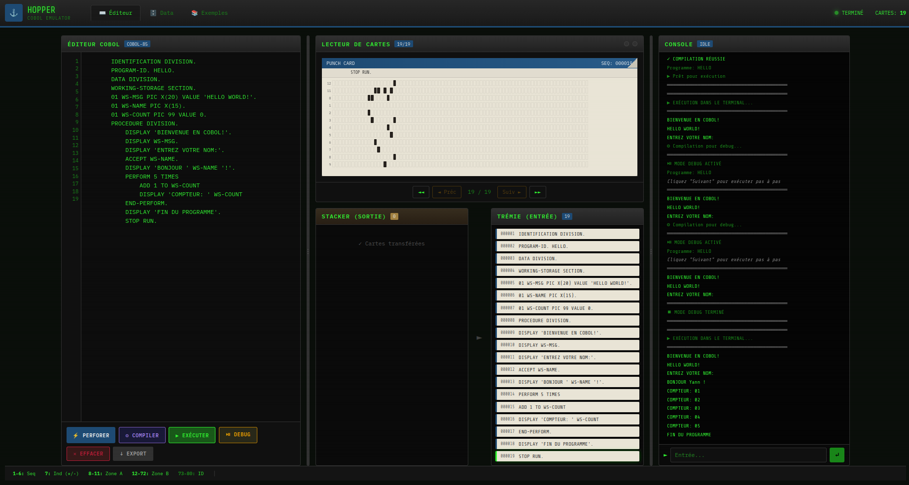

# HOPPER - COBOL Emulator

A web-based COBOL emulator with IBM 029 punch card visualization, running entirely in the browser.

**[Live Demo](https://meltingbot.github.io/hopper-cobol/)**



## Features

- **Multi-Dialect COBOL Interpreter** - Supports COBOL-68, 74, 85, 2002, and 2014
- **Auto-Detection** - Automatically detects the appropriate dialect from source code
- **IBM 3270 Screen Control** - Full-screen terminal emulation with positioning and attributes
- **Punch Card Visualization** - Realistic IBM 029 keypunch simulation with animations
- **Pedagogical Debug Mode** - Step-by-step execution with breakpoints, variable inspection, and French explanations
- **Subprograms & Copybooks** - CALL/CANCEL statements and COPY with REPLACING
- **Dot-Matrix Printer** - Retro green-bar paper output with tractor feed holes
- **File I/O** - Simulated SEQUENTIAL and INDEXED file operations via IndexedDB
- **SORT/MERGE** - Full support for sorting and merging data files
- **10 Example Programs** - Banking, invoicing, payroll, inventory management, etc.
- **Retro Terminal UI** - Authentic phosphor green aesthetic

## Supported COBOL Dialects

| Dialect | Standard | Key Features |
|---------|----------|--------------|
| COBOL-68 | ANSI | Basic COBOL, GO TO, PERFORM |
| COBOL-74 | ANSI X3.23-1974 | CALL, nested programs |
| COBOL-85 | ANSI X3.23-1985 | END-IF, EVALUATE, inline PERFORM |
| COBOL-2002 | ISO/IEC 1989:2002 | OOP, FUNCTION, Unicode |
| COBOL-2014 | ISO/IEC 1989:2014 | Dynamic tables, JSON support |

Use the dialect selector in the editor to choose a specific version or let auto-detection find the right one.

## Supported COBOL Features

HOPPER implements a comprehensive subset of COBOL-68 through COBOL-85:

| Category | Features |
|----------|----------|
| **Data Division** | Levels 01-88, PIC (including edited Z/*/,/.), VALUE (ALL), FILLER, REDEFINES, OCCURS, INDEXED BY |
| **Arithmetic** | ADD, SUBTRACT, MULTIPLY, DIVIDE, COMPUTE |
| **Control Flow** | IF/ELSE, EVALUATE, PERFORM (TIMES/UNTIL/VARYING), GO TO |
| **String Handling** | STRING, UNSTRING, INSPECT, Reference Modification `VAR(1:5)` |
| **Tables** | OCCURS, SEARCH, SEARCH ALL, subscripting |
| **File I/O** | OPEN, READ, WRITE, REWRITE, DELETE, CLOSE, SORT, MERGE |
| **Subprograms** | CALL, CANCEL, USING (BY REFERENCE/CONTENT/VALUE) |
| **Copybooks** | COPY, REPLACING, built-in copybooks (DATE-VARS, FILE-STATUS...) |
| **Screen Control** | IBM 3270 extensions (LINE, POSITION, ERASE, HIGHLIGHT...) |

**[Complete COBOL Reference Guide](docs/COBOL-REFERENCE.md)** - Full syntax documentation with examples

## Getting Started

### Local Development
```bash
# Clone the repository
git clone https://github.com/MeltingBot/hopper-cobol.git
cd hopper-cobol

# Start a local server (Python)
python -m http.server 8000

# Or with Node.js
npx serve .

# Open http://localhost:8000
```

### GitHub Pages

The site is deployed automatically via GitHub Pages at:
https://meltingbot.github.io/hopper-cobol/

No build step required - it's pure static HTML/CSS/JS!

## Usage

1. **Write COBOL** - Type or paste code in the editor
2. **Perforer** - Generate punch cards from code
3. **Compiler** - Compile the program
4. **Executer** - Run the program (opens terminal)
5. **Debug** - Step through execution with variable inspection

## Project Structure

```
hopper-cobol/
├── index.html              # Main application
├── css/styles.css          # Retro terminal styling
├── docs/
│   └── COBOL-REFERENCE.md  # Complete language reference
├── js/
│   ├── main.js             # App initialization
│   ├── editor.js           # Code editor & runtime
│   ├── punchCard.js        # IBM punch card encoding
│   ├── printer.js          # Dot-matrix printer simulation
│   ├── dataManagerIDB.js   # IndexedDB file storage
│   ├── tutorial.js         # Example programs
│   └── cobol/
│       ├── index.js        # CobolRuntime API & Copybook preprocessor
│       ├── lexer.js        # Tokenizer
│       ├── parser.js       # AST builder
│       ├── interpreter.js  # Execution engine
│       ├── explanations.js # Pedagogical explanations (French)
│       └── dialects.js     # Dialect configuration & detection
└── cobol-examples/         # Sample programs
    ├── demo-ecran.cob      # Screen control demo (IBM 3270)
    ├── gestion-clients.cob # Customer management (ERP)
    ├── facturation.cob     # Invoicing (ERP)
    └── ...
```

### Example Categories

| Category | Description |
|----------|-------------|
| DEMO | Pedagogical demonstrations (CALL/COPY, Printer) |
| ECRAN | Screen control demonstrations (IBM 3270) |
| ERP | Enterprise resource planning (clients, invoicing, inventory) |
| RH | Human resources (payroll) |
| BANQUE | Banking applications |
| TOURISME | Hotel reservations |
| BATCH | Batch processing (CSV import/export) |

## In Memory Of

**Grace Hopper (1906-1992)** - Pioneer of computer programming, co-inventor of COBOL, and the inspiration for this project's name.

## License

MIT License - Feel free to use, modify, and distribute.
